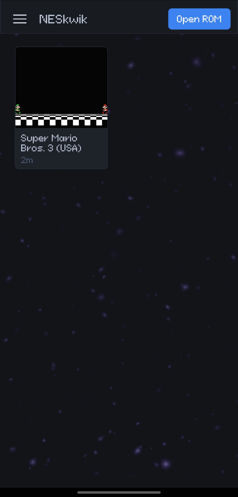
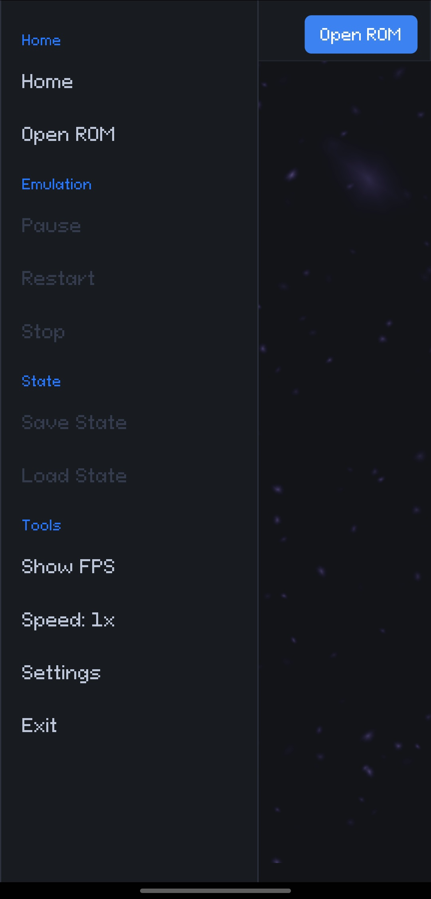
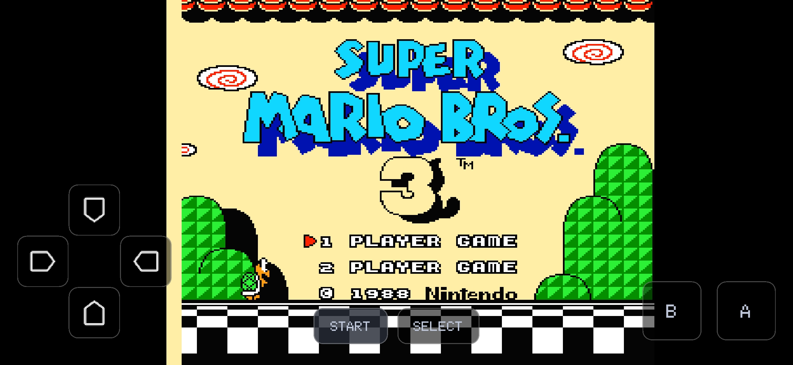

# NESkwik

NESkwik is a cross-platform (Linux, Windows, MacOS and Android) NES (Nintendo Entertainment System) emulator written in Zig. It has a custom desktop UI powered by [Clay](https://github.com/nicbarker/clay), audio output, gamepad support, a simple debug UI, and support for [RetroArch shaders](https://github.com/libretro/slang-shaders).


## Screenshots

| |  |
|:--:|:--:|
|  **Home screen** |  **Game running** |
| **RetroArch shader active**| **Shader in letterbox area**|

### Running on Android
| |  |
|:--:|:--:|
|||



## Features

- 6502 CPU, PPU, and APU emulation.
- SDL3-based desktop UI with Vulkan rendering.
- Keyboard and gamepad input for two players.
- Host-authoritative two-player desktop multiplayer.
- Configurable controls, aspect ratio, VSync, emulation speed.
- Pause, reset, stop, fullscreen, and step/debug controls.
- RetroArch `.slangp` shader preset loading
- Shaders for the letterbox area (border shader)

## Supported Mappers

- Mapper 0 (**NROM**)
- Mapper 1 (**MMC1**)
- Mapper 2 (**UxROM**)
- Mapper 3 (**CNROM**)
- Mapper 4 (**MMC3**)

That totals to around **1900** supported games of the NES library.

## Build - Requirements

- Zig 0.15.2.
- Rust 1.91 or newer (desktop multiplayer transport).
- Vulkan runtime and development headers/library available on your system.

Cross-compiling a desktop build to Windows also requires
[`cargo-zigbuild`](https://github.com/rust-cross/cargo-zigbuild). The required
Rust target and installation commands are covered in
[Cross-compilation](#cross-compilation).

### Android

Android builds require the Android SDK, command-line tools, platform tools, NDK, build tools, and a JDK. The build script currently expects:

- Android SDK with `ANDROID_HOME` set, or installed in a standard Android Studio location.
- JDK with `JDK_HOME` or `JAVA_HOME` set, or available on `PATH`.
- Android Build Tools `36.1.0`.
- Android NDK `28.2.13676358`.

If the exact build tools or NDK versions are missing, install them with `sdkmanager`:

```sh
sdkmanager "build-tools;36.1.0" "ndk;28.2.13676358" "platform-tools" "platforms;android-35"
```

#### Runtime Requirements

- Android 7.0/API 24 or newer.
- Vulkan support. 

## Build

```sh
zig build --release=fast
```

The executable is located at `zig-out/bin/neskwik`.

Desktop builds use the vendored `third-party/iroh-ffi` dependency, which
compiles and statically links its Rust archive into `neskwik`. Builds use
`cargo build` automatically except for Windows GNU, which always uses
`cargo zigbuild` so the Rust and Zig ABIs match even on a Windows host.

### Cross-compilation

To cross-compile the x86-64 Windows GNU build, install the Rust target and
`cargo-zigbuild` once:

```sh
rustup target add x86_64-pc-windows-gnu
cargo install --locked cargo-zigbuild
```

Then build the Windows executable directly through Zig:

```sh
zig build -Dtarget=x86_64-windows --release=fast
```

The build script invokes `cargo zigbuild` for `iroh-ffi`. The executable is
written to `zig-out/bin/neskwik.exe`.

Other non-native desktop targets require a compatible prebuilt `iroh-ffi`
static archive. Pass the directory containing that archive with:

```sh
zig build -Dtarget=<zig-target> -Diroh-lib-dir=/absolute/path/to/iroh/library
```

The archive must match the requested CPU, operating system, and ABI. Android
builds do not build or package iroh and remain offline-only.

### Android

Build a universal APK containing all supported Android ABIs:

```sh
zig build -Dandroid=true --release=fast
```

Build a smaller APK for one ABI:

```sh
zig build -Dtarget=aarch64-linux-android --release=fast
```

The APK is located at `zig-out/bin/neskwik.apk`.

Install and start the app on a connected device:

```sh
zig build run -Dtarget=aarch64-linux-android --release=fast
```

## Run

Open the UI without a ROM:

```sh
zig build run
```

Start directly with a ROM:

```sh
zig build run -- path/to/game.nes
```

Start with the debugger visible:

```sh
zig build run -- --debug path/to/game.nes
```

You need to provide your own `.nes` ROM files.

## Default Controls

### Player 1

| NES button | Key |
|:--|:--|
| D-pad | Arrow keys |
| A | Z |
| B | X |
| Select | Space |
| Start | Enter |

### Player 2

| NES button | Key |
|:--|:--|
| D-pad | W / A / S / D |
| A | I |
| B | O |
| Select | U |
| Start | P |

### Emulator

| Action | Key |
|:--|:--|
| Quit | Escape |
| Toggle debug / step mode | F9 |
| Pause / continue | F4 |
| Stop ROM | F5 |
| Restart ROM | F6 |
| Run one CPU tick in step mode | F10 |
| Run one frame in step mode | F11 |
| Toggle fullscreen | F |

Controls can be changed from the settings window.

## Shaders

NESkwik doesn't ship with the RetroArch `.slangp` shaders, you'll have to clone the [https://github.com/libretro/slang-shaders](https://github.com/libretro/slang-shaders) repository and place somewhere in your system. And then, you can select the shader by going to the "**Shader**" tab in the settings window. 

The border shaders can be selected from a couple of options in the "**Shader**" tab.

## Tests

Run the unit test suite:

```sh
zig build test
```

Run the explicitly gated, relay-free multiplayer loopback test:

```sh
NESKWIK_NETPLAY_LOOPBACK_TEST=1 zig build test -Dtest-filter="local loopback session"
```

Run ROM-based tests:

```sh
zig build test --release=fast -Drom-tests=true
```

ROM tests are slower. You can filter or skip them with:

```sh
zig build test --release=fast -Drom-tests=true -Dtest-filter=mmc3
zig build test --release=fast -Drom-tests=true -Dskip-rom-test=sprite_hit
```

It's recommended to run ROM tests in release mode.
