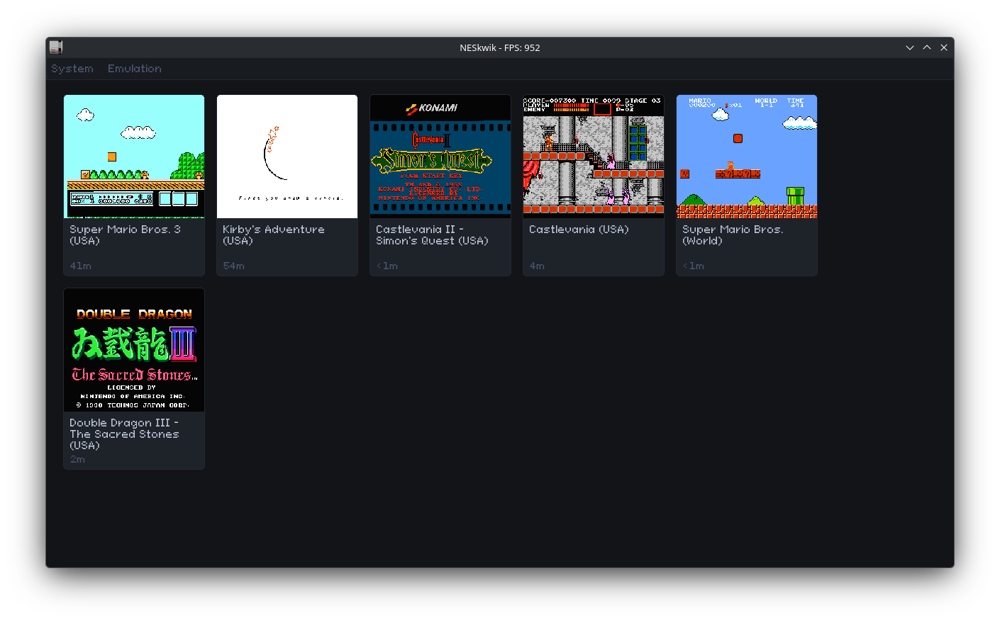
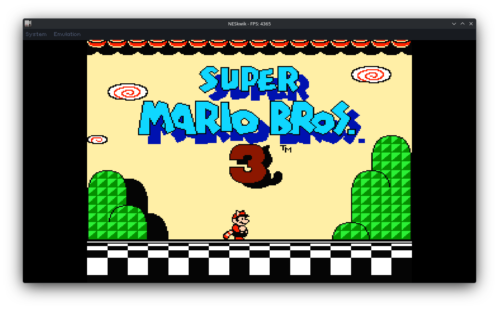
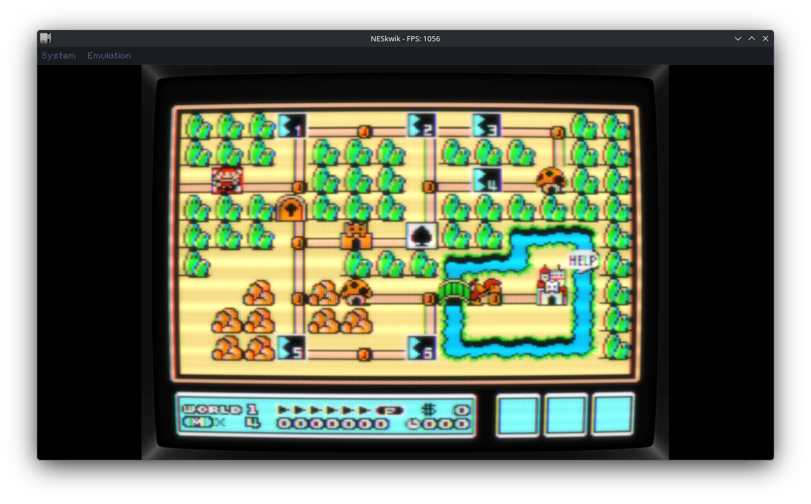
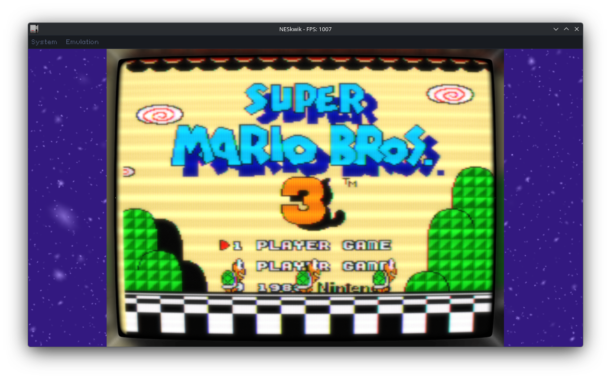

# NESkwik

NESkwik is a Nintendo Entertainment System emulator written in Zig. It has a custom desktop UI powered by [Clay](https://github.com/nicbarker/clay), audio output, gamepad support, a simple debug UI, and support for [RetroArch shaders](https://github.com/libretro/slang-shaders).


## Screenshots

| |  |
|:--:|:--:|
|  |  |
| **RetroArch shader active**| **Shader in letterbox area**|

## Features

- 6502 CPU, PPU, and APU emulation.
- SDL3-based desktop UI with Vulkan rendering.
- Keyboard and gamepad input for two players.
- Configurable controls, aspect ratio, VSync, emulation speed.
- Pause, reset, stop, fullscreen, and step/debug controls.
- RetroArch `.slangp` shader preset loading
- Shaders for the letterbox area (border shader)

## Supported Mappers

- Mapper 0 (**NROM**)
- Mapper 1 (**MMC1**)
- Mapper 2 (**UxROM**)
- Mapper 3 (**CNROM**)
- Mapper 4 (**MMC3**)

That totals to around **1900** supported games of the NES library.

## Requirements

- Zig 0.15.2.
- Vulkan runtime and development headers/library available on your system.

## Build

```sh
zig build --release=fast
```

The executable is installed to `zig-out/bin/ness`.

## Run

Open the UI without a ROM:

```sh
zig build run
```

Start directly with a ROM:

```sh
zig build run -- path/to/game.nes
```

Start with the debugger visible:

```sh
zig build run -- --debug path/to/game.nes
```

You need to provide your own `.nes` ROM files.

## Default Controls

### Player 1

| NES button | Key |
|:--|:--|
| D-pad | Arrow keys |
| A | Z |
| B | X |
| Select | Space |
| Start | Enter |

### Player 2

| NES button | Key |
|:--|:--|
| D-pad | W / A / S / D |
| A | I |
| B | O |
| Select | U |
| Start | P |

### Emulator

| Action | Key |
|:--|:--|
| Quit | Escape |
| Toggle debug / step mode | F9 |
| Pause / continue | F4 |
| Stop ROM | F5 |
| Restart ROM | F6 |
| Run one CPU tick in step mode | F10 |
| Run one frame in step mode | F11 |
| Toggle fullscreen | F |

Controls can be changed from the settings window.

## Shaders

NESkwik doesn't ship with the RetroArch `.slangp` shaders, you'll have to clone the [https://github.com/libretro/slang-shaders](https://github.com/libretro/slang-shaders) repository and place somewhere in your system. And then, you can set the shader by going to the "**Shader**" tab in the settings window. 
**TODO border shader**

## Tests

Run the unit test suite:

```sh
zig build test
```

Run ROM-based tests:

```sh
zig build test --release=fast -Drom-tests=true
```

ROM tests are slower. You can filter or skip them with:

```sh
zig build test --release=fast -Drom-tests=true -Dtest-filter=mmc3
zig build test --release=fast -Drom-tests=true -Dskip-rom-test=sprite_hit
```

It's recommended to run ROM tests in release mode.
