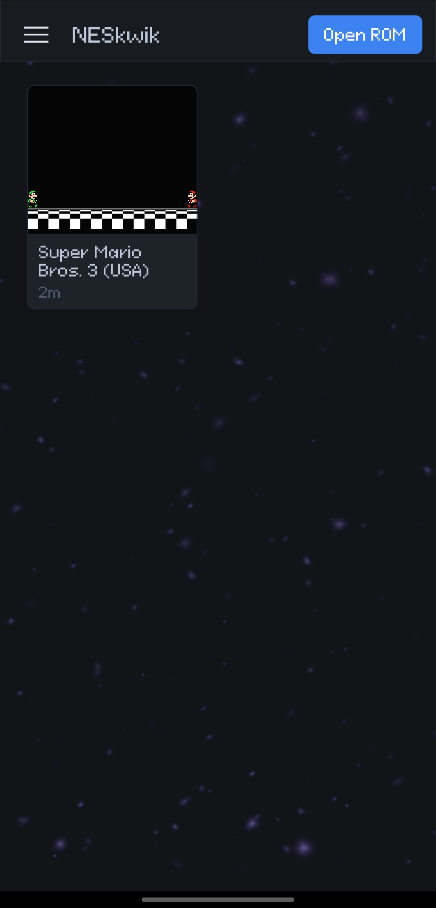
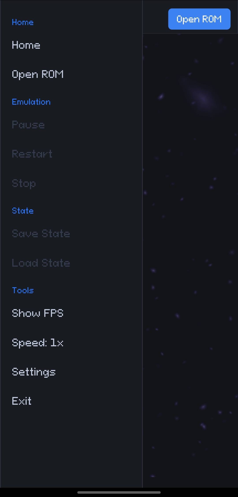
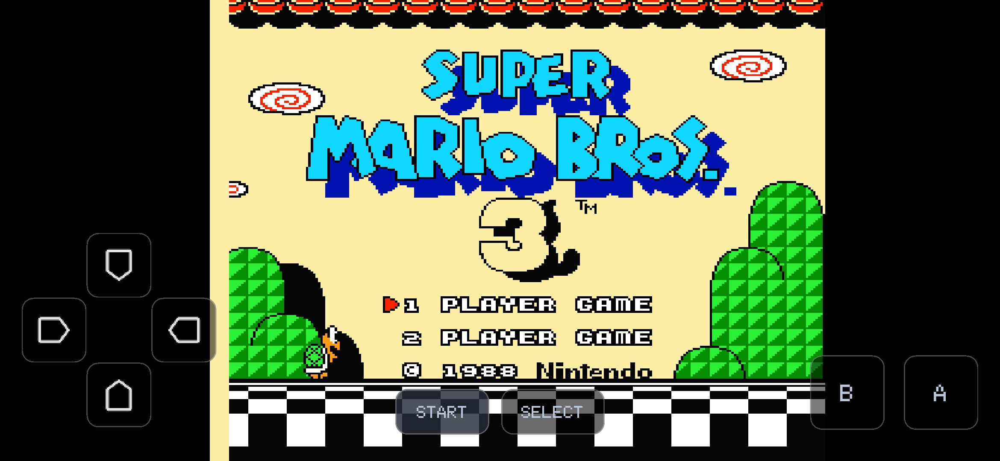

# NESkwik

NESkwik is a cross-platform (Linux, Windows, macOS, Android, and the browser) NES (Nintendo Entertainment System) emulator written in Zig. It has a custom UI powered by [Clay](https://github.com/nicbarker/clay), audio output, gamepad support, P2P multiplayer on native platforms, a simple debug UI, and native support for [RetroArch shaders](https://github.com/libretro/slang-shaders).


## Screenshots

| |  |
|:--:|:--:|
|  **Home screen** |  **Game running** |
| **RetroArch shader active**| **Shader in letterbox area**|

### Running on Android
| |  |
|:--:|:--:|
|||



## Features

- 6502 CPU, PPU, and APU emulation.
- SDL3-based desktop UI with Vulkan rendering.
- Keyboard and gamepad input for two players.
- P2P multiplayer for co-op games.
- Configurable controls, aspect ratio, VSync, emulation speed.
- Pause, reset, stop, fullscreen, and step/debug controls.
- RetroArch `.slangp` shader preset loading
- Shaders for the letterbox area (border shader)

## Supported Mappers

- Mapper 0 (**NROM**)
- Mapper 1 (**MMC1**)
- Mapper 2 (**UxROM**)
- Mapper 3 (**CNROM**)
- Mapper 4 (**MMC3**)

That totals to around **1900** supported games of the NES library.

## Build - Requirements

- Zig 0.16.0.
- Rust 1.91 or newer for native netplay, provided by [`iroh-ffi`](https://github.com/n0-computer/iroh-ffi).
- Vulkan runtime and development headers/library for the native shader renderer.
- [Emscripten SDK](https://emscripten.org/docs/getting_started/downloads.html) for the browser build (see [Browser / WebAssembly](#browser--webassembly)).

### Android

Android builds require the Android SDK, command-line tools, platform tools, NDK, build tools, and a JDK. The build script currently expects:

- Android SDK with `ANDROID_HOME` set, or installed in a standard Android Studio location.
- JDK with `JDK_HOME` or `JAVA_HOME` set, or available on `PATH`.
- Android Build Tools `36.1.0`.
- Android NDK `28.2.13676358`.
- Rust Android targets for each ABI being built.
- [`cargo-ndk`](https://github.com/bbqsrc/cargo-ndk).

If the exact build tools or NDK versions are missing, install them with `sdkmanager`:

```sh
sdkmanager "build-tools;36.1.0" "ndk;28.2.13676358" "platform-tools" "platforms;android-35"
rustup target add aarch64-linux-android x86_64-linux-android
cargo install --locked cargo-ndk
```

#### Runtime Requirements

- Android 7.0/API 24 or newer.
- Vulkan support. 

## Build
To build the project simply run:
```sh
zig build --release=fast
```

The final executable is located at `zig-out/bin/neskwik`.

### Browser / WebAssembly

Install and activate the [Emscripten SDK](https://emscripten.org/docs/getting_started/downloads.html) so `emcc`, `em-config`, `embuilder`, and `emrun` are available on `PATH`, then run:

```sh
zig build --release=fast -Dtarget=wasm32-emscripten
```
The build output will be at `zig-out/web`.

Zig 0.16's standard library does not compile for Emscripten as-is, so the build also patches a few files in the `lib/std` directory of the Zig installation running it.

To build and run the WASM app, use:

```sh
zig build run --release=fast -Dtarget=wasm32-emscripten
```

What differs from the native builds:

- RetroArch `.slangp` [shaders](https://github.com/libretro/slang-shaders) are supported. Shaders are compiled like on desktop and then translated to GLSL ES 3.00 for WebGL 2; the few presets that need features WebGL 2 lacks (such as `textureGather`) fail to load with an error message.
- Settings, history, save states, battery saves, imported shaders, and the compiled shader cache are persisted in the browser's storage (IndexedDB).
- Touch devices get the mobile layout.
- Netplay is not available.

### Cross-compilation

To cross-compile the x86-64 Windows GNU build, install the Rust target and `cargo-zigbuild` once:

```sh
rustup target add x86_64-pc-windows-gnu
cargo install --locked cargo-zigbuild
```

Then build the Windows executable directly through Zig:

```sh
zig build -Dtarget=x86_64-windows --release=fast
```

The executable is written to `zig-out/bin/neskwik.exe`.

Other non-native desktop targets require a compatible prebuilt `iroh-ffi` static archive. Pass the directory containing that archive with:

```sh
zig build -Dtarget=<zig-target> -Diroh-lib-dir=/absolute/path/to/iroh/library
```

### Android

Build a universal APK containing all supported Android ABIs:

```sh
zig build -Dandroid=true --release=fast
```

Build a smaller APK for one ABI:

```sh
zig build -Dtarget=aarch64-linux-android --release=fast
```

The APK is located at `zig-out/bin/neskwik.apk`.

Install and start the app on a connected device:

```sh
zig build run -Dtarget=aarch64-linux-android --release=fast
```

## Run

Open the UI without a ROM:

```sh
zig build run
```

Start directly with a ROM:

```sh
zig build run -- path/to/game.nes
```

Start with the debugger visible:

```sh
zig build run -- --debug path/to/game.nes
```

You need to provide your own `.nes` ROM files.

## Default Controls

### Player 1

| NES button | Key |
|:--|:--|
| D-pad | Arrow keys |
| A | Z |
| B | X |
| Select | Space |
| Start | Enter |

### Player 2

| NES button | Key |
|:--|:--|
| D-pad | W / A / S / D |
| A | I |
| B | O |
| Select | U |
| Start | P |

### Emulator

| Action | Key |
|:--|:--|
| Quit | Escape |
| Toggle debug / step mode | F9 |
| Pause / continue | F4 |
| Stop ROM | F5 |
| Restart ROM | F6 |
| Run one CPU tick in step mode | F10 |
| Run one frame in step mode | F11 |
| Toggle fullscreen | F |

Controls can be changed from the settings window.

## Shaders

NESkwik doesn't ship with the RetroArch `.slangp` shaders, you'll have to clone the [https://github.com/libretro/slang-shaders](https://github.com/libretro/slang-shaders) repository and place somewhere in your system. And then, you can select the shader by going to the "**Shader**" tab in the settings window. 

The border shaders can be selected from a couple of options in the "**Shader**" tab.

In the browser, shaders are imported into the browser's storage first; see [Browser / WebAssembly](#browser--webassembly).

## Tests

Run the unit test suite:

```sh
zig build test
```

Run the relay-free multiplayer loopback test:

```sh
NESKWIK_NETPLAY_LOOPBACK_TEST=1 zig build test -Dtest-filter="local loopback session"
```

Run ROM-based tests:

```sh
zig build test --release=fast -Drom-tests=true
```

ROM tests are slower. You can filter or skip them with:

```sh
zig build test --release=fast -Drom-tests=true -Dtest-filter=mmc3
zig build test --release=fast -Drom-tests=true -Dskip-rom-test=sprite_hit
```

It's recommended to run ROM tests in release mode.
